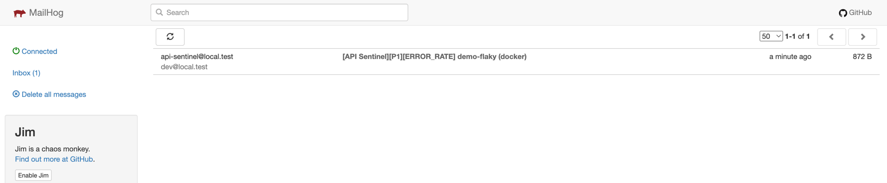
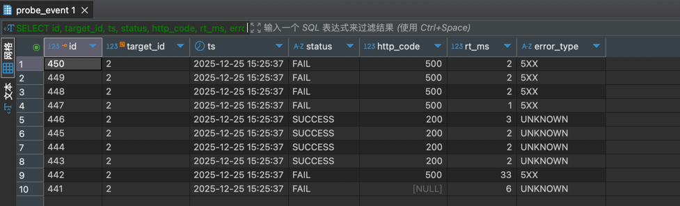

## API Reliability Sentinel

面向关键接口的**主动探测（Probe）+ 事件归集 + 告警聚合/降噪 + 通知（Email）+ 可观测性**示例项目，用于演示“分钟级 → 秒级发现定位”的工程化闭环落地。

### 解决的问题

* 关键接口是否可用？是否出现 RT 抖动、错误率升高、依赖超时？
* 告警如何**分级、去重、聚合**，避免告警风暴？
* 如何把“发现问题 → 定位问题 → 恢复问题”做成机制闭环（MTTD/MTTR）？

### 主要能力（M1）

* **Target 管理**：配置探测目标（方法、URL、超时、重试、窗口、阈值、静默等）
* **Probe 事件归集**：对目标接口发起探测并写入 `probe_event`
* **Alert 聚合去重**：按窗口聚合生成/合并 `alert_event`（ERROR_RATE）
* **通知通道（Email）**：OPEN / REOPEN 触发邮件，写入 `notify_log`（本地默认 MailHog）
* **可追溯性**：关键链路落库，可通过 DB 或 API 复盘（接入 TraceId）

---

## 架构概览

```
+-------------------+       probe results        +------------------+
| Probe Scheduler   |  ----------------------->  | Alert Aggregator |
| (interval/timeout)|                            | (dedupe/window)  |
+---------+---------+                            +--------+---------+
          |                                           |
          | http checks                               | notifications
          v                                           v
+-------------------+                      +----------------------+
| Target APIs (demo)|                      | Email Notifier       |
| /demo/ok/error/...|                      | (MailHog in local)   |
+-------------------+                      +----------------------+
          |
          v
+-------------------+
| Event Store (DB)  |
| probe_target      |
| probe_event       |
| alert_event       |
| notify_log        |
+-------------------+
```


---

## 技术栈

* Java 17 / Spring Boot 3
* MySQL（事件落库）
* MyBatis-Plus
* Docker Compose 一键启动
* OpenAPI/Swagger UI（可选）

---

## 快速开始（Docker Compose）

### 0) 启动

```bash
docker compose up -d --build
```

### 1) 服务入口（以 compose 映射为准）

* Sentinel App（API）：`http://localhost:8080`（示例）
* Demo API：`http://localhost:8081`（示例）
* MailHog Web UI：`http://localhost:8025`
* MySQL：`localhost:3307`

```bash
docker compose ps
```

---

## 快速验证


### 约定环境变量

```bash
export SENTINEL_BASE="http://localhost:8080"
```

### Step 1：确认 Demo API 可用（1/5）

```bash
curl -sS "$DEMO_BASE/demo/ok" | jq
```

### Step 2：创建一个探测目标（2/5）

下面示例创建一个有概率失败的目标（指向 `/demo/flaky`），用于快速触发 ERROR_RATE 告警。

```bash
curl -sS -X 'POST' \
  'http://localhost:8080/api/targets' \
  -H 'accept: */*' \
  -H 'Content-Type: application/json' \
  -d '{
  "name": "demo-flaky",
  "owner": "fluffycat",
  "headers": {
    "xenv": "docker"
  },
  "method": "GET",
  "errorRateThreshold": 20,
  "intervalSec": 60,
  "enabled": true,
  "tags": "demo",
  "path": "/demo/flaky?failRate=50",
  "windowSec": 300,
  "baseUrl": "http://demo-api:8081",
  "timeoutMs": 800,
  "env": "docker"
}' | jq
```

### Step 3：查询目标列表，拿到 targetId（3/5）

```bash
curl -sS "$SENTINEL_BASE/api/targets" | jq
```

### Step 4：触发探测并生成事件（4/5）

```bash
curl -sS -X 'POST' \
  'http://localhost:8080/api/probe/run-once' \
  -H 'accept: */*' \
  -H 'Content-Type: application/json' \
  -d '{
  "targetId": 2,
  "times": 10,
  "intervalMs": 20
}' | jq

```

### Step 5：查看邮件（5/5）

打开 MailHog Web UI：

* `http://localhost:8025`

应当能看到一封 ERROR_RATE 告警邮件（OPEN 或 REOPEN）。

**MailHog 收件箱**


---

## 数据验证（DB 复盘）

### 1) 验证 probe_event 是否写入

```sql
SELECT id, target_id, ts, status, http_code, rt_ms, error_type
FROM probe_event
ORDER BY id DESC
LIMIT 10;
```

### 2) 验证 alert_event 是否生成/合并（OPEN/RESOLVED）

```sql
SELECT id, target_id, alert_type, status, first_seen_ts, last_seen_ts, last_sent_ts, count_in_window
FROM alert_event
ORDER BY id DESC
LIMIT 10;
```

### 3) 验证 notify_log 是否落库

```sql
SELECT id, alert_id, channel, receiver, status, error_msg, created_at
FROM notify_log
ORDER BY id DESC
LIMIT 10;
```

**DB 查询结果（probe_event / alert_event / notify_log）**


---

## 关键设计点（M1）

### Probe 策略

* 探测频率：`intervalSec`
* 超时/重试：`timeoutMs` / `retries`
* 事件落库：每次探测写入 `probe_event`，用于复盘与聚合

### 告警聚合与降噪（ERROR_RATE）

* 窗口：`windowSec`
* 统计：窗口内 `total/fail/errorRatePct`
* 去重：同一 `dedupe_key` 的 OPEN 告警合并更新，不重复插入
* 恢复：当窗口内 errorRate 恢复到阈值以下，OPEN → RESOLVED

### 静默（silence）

* `silenced_until` 用于维护期不发通知，但仍可继续落 `probe_event`/`alert_event`

---

## Roadmap（里程碑）

* M1：Target + Probe 落库 + ERROR_RATE 告警 + Email（MailHog）闭环
* M2：频控重发（last_sent_ts）、ACK/REOPEN 完整状态机、责任人路由、并发探测
* M3：基础看板（MTTD/MTTR/错误率趋势）+ 压测数据对比
* M4：接入 OTel/Prometheus

---

## License

MIT

---

## 仓库目录结构

```
api-reliability-sentinel/
  README.md
  docs/
    architecture.md
    data-model.md
    alerting.md
    images/                
  docker/
    docker-compose.yml
  demo-api/
  sentinel-app/
  probe/
  alert/
```

